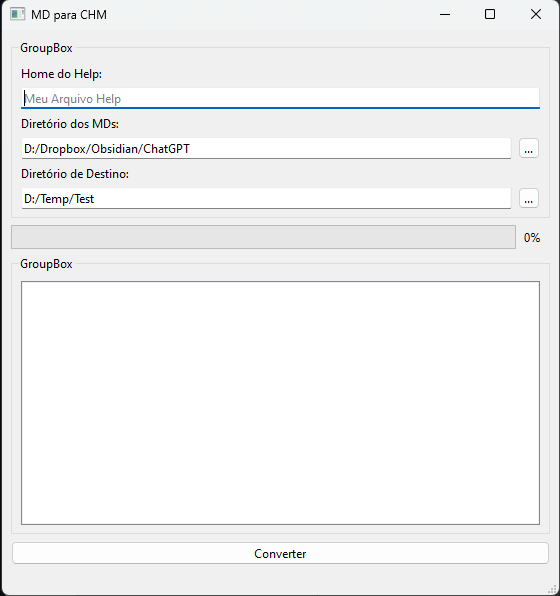

# MD-TO-CHM

Application created in c++ (qmake) to convert Markdown (MD) files structured in hierarchical folders into help CHM files

## What's done:

- User UI
- Hierarchical search of MD files
- MD to HTML conversion
- Compilation using HTML Help Workshop Compiler

## What remains to be finished:

- Waiting for new ideas

## Challenges:

- Embed the HTML Help Workshop Compiler as a Resource File
- Compatibility with Windows 7